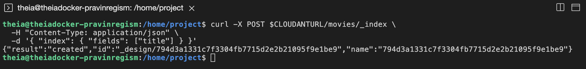

# Working with NoSQL Databases

In this project, we apply the skills gained from the **[Introduction to NoSQL Databases](https://www.coursera.org/learn/introduction-to-nosql-databases)** course to work with different databases for data migration and analysis.

This project has four parts: 

- Exercise 1 - Check the lab environment
  - Export the json into your Cloudant Database
- Exercise 2 - Working with a Cloudant database
  - Replicate a local database into your Cloudant instance
  - Create an index for the `Director` key, on the `movies` database using the HTTP API
  - Write a query to find all movies directed by `Richard Gage` using the HTTP API
  - Create an index for the `title` key, on the `movies` database using the HTTP API
  - Write a query to list only the `year` and `Director` keys for the `Top Dog` movies using the HTTP API
  - Export the data from the `movies` database into a file named `movies.json`
- Exercise 3 - Working with a MongoDB database
  - Import `movies.json` into mongodb server into a database named `entertainment` and a collection named `movies`
  - Write a mongodb query to find the year in which most number of movies were released
  - Write a mongodb query to find the count of movies released after the year 1999
  - Write a query to find out the average votes for movies released in 2007
  - Export the fields `_id`, `title`, `year`, `rating` and `director` from the `movies` collection into a file named `partial_data.csv`
- Exercise 4 - Working with a Cassandra database
  - Import `partial_data.csv` into cassandra server into a keyspace named `entertainment` and a table named `movies`
  - Write a cql query to count the number of rows in the `movies` table
  - Create an index for the `rating` column in the `movies` table using cql
  - Write a cql query to count the number of movies that are rated `G`

## Exercise 1 - Check the lab environment

Before you proceed with the Final Assignment Project:

Check if you have the `couchimport` tool installed, otherwise install it.

```bash
chmod 744 couchimport_install.sh
./couchimport_install.sh
```


Check if you have the `mongoimport` and `mongoexport` tools installed, otherwise install them.

```bash
chmod 744 mongoimport_install.sh
./mongoimport_install.sh
```


Check if the environment variable `CLOUDANTURL` is set, otherwise set it.

```bash
export CLOUDANTURL="your_url_here"
```

Where `"your_url_here"` is the `url` value found under your instance's `Service credentials`.

Check if the environment variable `MONGO_PASSWORD` is set, otherwise set it.

```bash
export MONGO_PASSWORD="mongodb_password"
```

Where `"mongodb_password"` is the MongoDB Server password for the `root` user.

Check if the environment variable `CASSANDRA_PASSWORD` is set, otherwise set it.

```bash
export CASSANDRA_PASSWORD="cassandra_password"
```

Where `"cassandra_password"` is the Cassandra Server password for the `cassandra` user.

### Export the json into your Cloudant Database

Go to your Cloudant service created on IBM Cloud, then follow these steps to create a new database.

**Step 1:**  Click on `Launch Dashboard` to launch the cloudant databases.


**Step 2:** Click on `Create Database` on the top-right corner.


Create a Non-patitioned database named `movies`.


**Step 3:** Set your database name to `movies`.

**Step 4:** Select `Non-patitioned` database.

*IMPORTANT: Partitioning type is set at database creation. You cannot change the partitioning type of an existing database.*

**Step 5:** Click on `Create`

You should see a screen like this


*Alternatively, you can create a Non-partitioned database named `movies` using the HTTP API.*

```bash
curl -X PUT $CLOUDANTURL/movies
```

*A response of `{"ok":true}` indicates that the database is sucessfully created.*

**Step 6:** Verify by listing all databases.

```bash
curl $CLOUDANTURL/_all_dbs
```

You should see a list of your databases. For example, `["movies"]`.

**Step 7:** Run the given command in the terminal to export the data of the `movie.json` file into your Cloudant database `movies`.

```bash
curl -X POST $CLOUDANTURL/movies/_bulk_docs -Hcontent-type:application/json -d @movie.json
```


## Exercise 2 - Working with a Cloudant database

### Task 1 - Replicate a local database into your Cloudant instance

Using the `Replication` page in the Cloudant dashboard, click `New Replication`.


Replicate the below source database using one time replication.


Source

* Type : `Local database`
* Name: `movies`
* Authentication : `IAM Authentication`
  - Add your Cloudant API key below. (You can find it in the `Service credentials` tab)

Target

* Type: `New local database`
* Authentication : `IAM Authentication`
  - Add your Cloudant API key below. (You can find it in the `Service credentials` tab)

Options

* Replication type: `One time`

Click on `Start Replication`

You should see a screen like this


Once the replication is done, click the Database’s dashboard, which shows database name, number of rows, etc.


### Task 2 - Create an index for the `Director` key, on the `movies` database using the HTTP API

```bash
curl -X POST $CLOUDANTURL/movies/_index \
  -H "Content-Type: application/json" \
  -d '{ "index": { "fields": ["Director"] } }'
```


### Task 3 - Write a query to find all movies directed by `Richard Gage` using the HTTP API

```bash
curl -X POST $CLOUDANTURL/movies/_find \
  -H "Content-Type: application/json" \
  -d '{ "selector": { "Director": "Richard Gage" } }'
```


### Task 4 - Create an index for the `title` key, on the `movies` database using the HTTP API

```bash
curl -X POST $CLOUDANTURL/movies/_index \
  -H "Content-Type: application/json" \
  -d '{ "index": { "fields": ["title"] } }'
```



### Task 5 - Write a query to list only the `year` and `Director` keys for the `Top Dog` movies using the HTTP API

```bash
curl -X POST $CLOUDANTURL/movies/_find \
  -H "Content-Type: application/json" \
  -d '{ "selector": { "title": "Top Dog" }, "fields": [ "year", "Director" ] }'
```


### Task 6 - Export the data from the `movies` database into a file named `movies.json`

```bash
couchexport --url $CLOUDANTURL --db movies --type jsonl > movies.json
```


## Exercise 3 - Working with a MongoDB database

### Task 7 - Import `movies.json` into mongodb server into a database named `entertainment` and a collection named `movies`

*Note: Please use the `movies.json` file that gets created as part of Task 6 and not the `movie.json` file that was downloaded as part of Exercise 1.* 

```bash
mongoimport -u root -p ${MONGO_PASSWORD} --authenticationDatabase admin --db entertainment --collection movies --file movies.json
```


### Task 8 - Write a mongodb query to find the year in which most number of movies were released

```bash
mongosh -u root -p ${MONGO_PASSWORD} --authenticationDatabase admin local
```


```bash
use entertainment
```


```bash
db.movies.aggregate([
    { $group: { _id: "$year", moviecount: { $sum: 1 } } },
    { $sort: { moviecount: -1 } },
    { $limit: 1 }
])
```

Your query should:
* Group movies by their release year.
* Calculate the total count of movies for each year.
* Sort the years in descending order of movie count.
* Limit the output to 1 document (year) which has the highest movie count.


### Task 9 - Write a mongodb query to find the count of movies released after the year 1999

```bash
db.movies.aggregate([
    { $match: { year: { $gt: 1999 } } },
    { $group: { _id: "$year", moviecount: { $sum: 1 } } },
    { $sort: { _id: -1 } }
])
```


### Task 10. Write a query to find out the average votes for movies released in 2007

Use the `$match` operator to filter for movies released in 2007.

```bash
db.movies.aggregate([
    { $match: { year: 2007 } },
    { $group: { _id: "$year", avgVotes: { $avg: "$Votes" } } }
])
```


### Task 11 - Export the fields `_id`, `title`, `year`, `rating` and `Director` from the `movies` collection into a file named `partial_data.csv`

```bash
mongoexport -u root -p ${MONGO_PASSWORD} --authenticationDatabase admin --db entertainment --collection movies --out partial_data.csv --type=csv --fields _id,title,year,rating,Director
```


## Exercise 4 - Working with a Cassandra database

### Task 12 - Import `partial_data.csv` into cassandra server into a keyspace named `entertainment` and a table named `movies`

Note: While creating the table movies make the all the columns as text columns including the id column.

```bash
cqlsh --username cassandra --password ${CASSANDRA_PASSWORD}
```


Create a keyspace named `entertainment` using `SimpleStrategy` and a replication factor of `1`. `SimpleStrategy` is used when all the nodes in your cassandra cluster exist in a single data center

```bash
create keyspace entertainment  
with replication = {'class':'SimpleStrategy', 'replication_factor' : 1};
```


```bash
use entertainment;
create table movies(
id text PRIMARY KEY,
title text,
year text,
rating text,
Director text
);
```


```bash
copy entertainment.movies(id,title,year,rating,Director) from 'partial_data.csv' with delimiter=',' and header=true;
```


### Task 13 - Write a cql query to count the number of rows in the `movies` table

```bash
select count(*) from movies;
```


### Task 14 - Create an index for the `rating` column in the `movies` table using cql

```bash
create index rating_index on movies(rating);
```


### Task 15 - Write a cql query to count the number of movies that are rated ‘G’.

```bash
select count(*) from movies where rating = 'G';
```


End of assignment.

## Change Log

|  Date (YYYY-MM-DD) |  Version | Changed By  |  Change Description |
|---|---|---|---|
| 2024-05-14  | 0.2  | Pravin Regismond | Modified to fulfill project requirements |
| 2023-05-26  | 0.1  | Ramesh Sannareddy | Initial Version Created |

Copyright © 2023 IBM Corporation. All rights reserved.