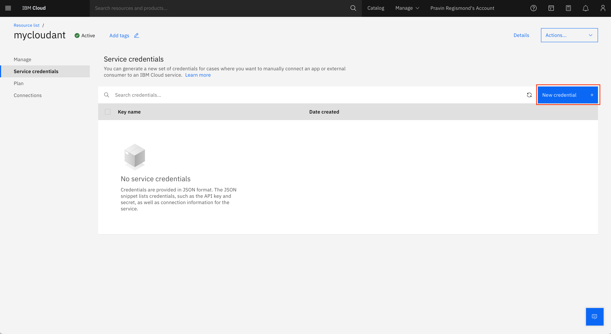

# How to Create an IBM Cloudant Instance

## Prerequisites

Before starting, you will need to create an IBM Cloud account to work with IBM Cloudant.

If you do not have an account, visit [cloud.ibm.com](https://cloud.ibm.com/registration).

*Note: IBM does asks for your credit card to verify your identity. You will not be charged for any usage within the free tier. Learn more: [www.ibm.com/cloud/free](https://www.ibm.com/cloud/free)*

Login using your IBM Cloud credentials.

## Create an IBM Cloudant Instance

**Step 1:** Click on [cloud.ibm.com/catalog/services/cloudant](https://cloud.ibm.com/catalog/services/cloudant) to create a free multi-tenent Cloudant instance.

Or you can alternatively click on `Create resource`, search for `Cloudant` on the Dashboard page.

You will be taken to the Cloudant instance creation page.

**Step 2:** Select the region under the `Available regions`.

**Step 3:** Scroll down to configure Cloudant instance.

**Step 4:** Set your instance name to `mycloudant` or anything else that you prefer.

**Step 5:** Select `IAM and legacy credentials` as your Authentication method.

**Step 6:** Select the `Lite` plan.

**Step 7:** Click on `Create`

You should see a screen like this

Your Cloudant service will be created and you will be redirected to the `Resource list` page.

**Step 8:** If you are not redirected, you can click on this link [cloud.ibm.com/resources?groups=resource-instance](https://cloud.ibm.com/resources?groups=resource-instance)

**Step 9:** Wait till the status turns `Active` and click on `mycloudant` or your custom instance name.

You will be taken to the Cloudant instance page.

**Step 10:** On the Cloudant instance page, click on `Service credentials`

**Step 11:** Click on `New credential`.

**Step 12:** Create credential pop up appears. Accept the default values for Name and Role and click on `Add`

**Step 13:** Your Cloudant Service credentials will be created. Click on the chevron to view the credentials.

**Step 14:** You will be using the `username`, `password` and `url` in the Final Assignment Project.

You have successfully created a Cloudant instance and Service credentials for your instance.
